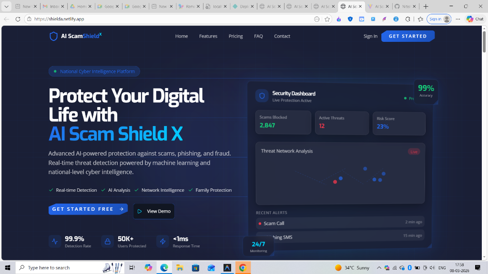

# 🛡️ AI Scam Shield X
### *The Next-Generation National Cyber Intelligence Platform*

[](https://shielda.netlify.app/)
[](https://drive.google.com/drive/folders/1oo_lECv71zWjObHYpm4bVsmWf58XpDH2?usp=drive_link)
[](https://github.com/Nitishkumar2026/Scan-Shield-AI)
[](https://react.dev)
[](https://www.typescriptlang.org/)
[](https://vitejs.dev/)
[](https://tailwindcss.com/)

## 🔗 Quick Links
- **Live Project:** [https://shielda.netlify.app/](https://shielda.netlify.app/)
- **Project Resources:** [https://drive.google.com/drive/folders/1oo_lECv71zWjObHYpm4bVsmWf58XpDH2?usp=drive_link](https://drive.google.com/drive/folders/1oo_lECv71zWjObHYpm4bVsmWf58XpDH2?usp=drive_link)

## 📸 Project Preview


---

## 🚀 Vision
In an era of increasingly sophisticated digital fraud, **AI Scam Shield X** stands as a robust, AI-powered defensive layer. Designed for national-level scalability, it empowers citizens with real-time threat intelligence and proactive defense mechanisms against financial scams, phishing attacks, and social engineering.

## ✨ Key Features

### 🧠 Advanced Neural Detection
*   **Real-time Call Analysis**: Deep sentiment and intent analysis on live call transcripts to identify scam patterns before they succeed.
*   **Intelligent SMS Scanner**: Scans incoming messages for malicious URLs, social engineering tactics, and known phishing signatures.
*   **UPI Fraud Analyzer**: Pre-transaction verification of UPI IDs against a massive, real-time threat intelligence database.

### 🛡️ Family Guardian Mode
*   **Centralized Protection**: Monitor and protect up to 6 family members from a single dashboard.
*   **Instant Alerts**: Receive real-time notifications when a vulnerable family member interacts with a potential threat.
*   **Safe-List Management**: Curate trusted contacts and entities for your entire household.

### 🕸️ Fraud Network Intelligence
*   **Graph Visualizations**: Interactive D3.js powered fraud graphs showing the connections between different scam entities.
*   **Threat Heatmaps**: Geographic visualization of active threat clusters across the country.
*   **Mule Account Tracking**: AI-driven identification of potential money-mule accounts and laundering chains.

### 🖥️ Enterprise Admin Portal
*   **Institutional Access**: Purpose-built dashboards for banks and law enforcement agencies.
*   **Neural Traffic Analytics**: Real-time monitoring of network-wide threat propagation.
*   **Automated Takedowns**: Streamlined reporting to CERT-In and relevant authorities for rapid response.

## 🛠️ Tech Stack

- **Frontend**: `React 19`, `Vite`, `TypeScript`
- **Styling**: `Tailwind CSS`, `Custom Cyber Grid System`
- **Animations**: `Framer Motion` (for fluid, high-fidelity UI transitions)
- **Charts/Graphs**: `Recharts`, `D3.js`
- **Icons**: `Lucide React`
- **State Management**: `React Hooks`, `Context API`

## 📦 Installation & Setup

1. **Clone the repository**
   ```bash
   git clone https://github.com/Nitishkumar2026/Scan-Shield-AI.git
   cd Scan-Shield-AI
   ```

2. **Setup Frontend**
   ```bash
   cd app
   npm install
   npm run dev
   ```

3. **Explore Dashboard**
   Navigate to `http://localhost:5173` to see the futuristic dashboard in action.

## 🌐 Deployment (Netlify)

To deploy the frontend to Netlify:

1.  Connect your GitHub repository to Netlify.
2.  Set the **Base Directory** to `app`.
3.  Set the **Build Command** to `npm run build`.
4.  Set the **Publish Directory** to `app/dist`.
5.  Add the following **Environment Variables** (if applicable):
    *   `VITE_API_BASE_URL` - Your backend endpoint.

## 📈 Roadmap

- [x] High-fidelity Cyber UI/UX
- [x] Real-time SMS & Call analysis components
- [x] Administrative Intelligence Portal
- [ ] Mobile App (Social Shield Mobile)
- [ ] Integration with National Cyber Crime Reporting Portal (NCRP)
- [ ] Blockchain-based verified entity registry

---

<p align="center">
  <strong>Built for the 21st Century Cyber Defense 🇮🇳</strong>
</p>
