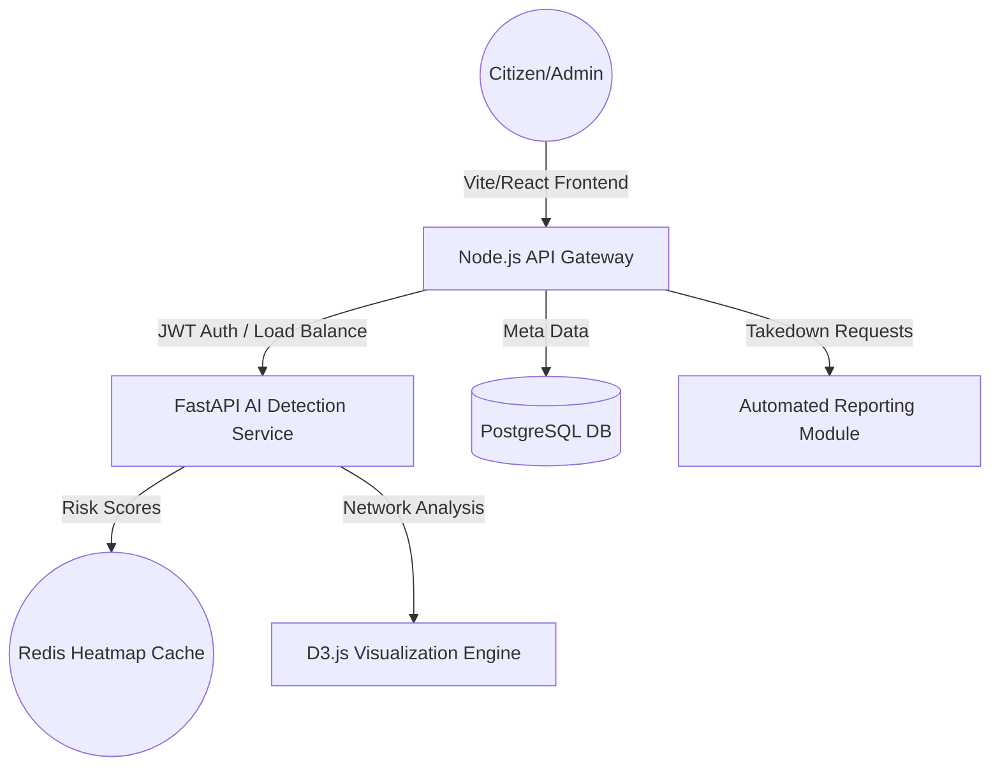

# 🛡️ AI Scam Shield X
### *The Next-Generation National Cyber Intelligence Platform*

[](https://shielda.netlify.app/)
[](https://drive.google.com/drive/folders/1oo_lECv71zWjObHYpm4bVsmWf58XpDH2?usp=drive_link)
[](https://github.com/Nitishkumar2026/Scan-Shield-AI)
[](https://react.dev)

---

## 1. 💡 IDEA TITLE
**AI Scam Shield X**: A Multi-Layered AI Defensive Ecosystem for National Cyber Security.

## 2. 📝 IDEA DESCRIPTION

### The Problem
India is witnessing a "digital pandemic" of cyber-crimes. In 2024 alone, reported financial losses from scams reached unprecedented levels. Scammers leverage advanced social engineering, UPI-based phishing, and spoofed calls to target vulnerable populations—specifically the elderly and first-time digital users. Current solutions are fragmented: banking apps focus only on transactions, while SMS filters are easily bypassed by seasonal variations.

### The Solution
**AI Scam Shield X** is a unified, proactive intelligence platform designed to neutralize threats before they manifest as financial loss. It moves beyond simple blacklisting into **behavioral and intent-based detection**.

**Core Value Propositions:**
- **Zero-Trust Communication**: Real-time AI analysis of call transcripts and SMS intent using advanced NLP.
- **Family Guardian Ecosystem**: Centralized protection for households where tech-savvy users can monitor and safeguard their vulnerable family members.
- **National Intelligence Hub**: Enterprise-grade dashboards for Law Enforcement Agencies (LEAs) to track mule accounts and fraud networks using interactive graph theory.

## 3. ⚙️ TECHNICAL DETAILS

### Technologies Used
| Layer | Technologies |
| :--- | :--- |
| **Frontend** | React 19, TypeScript, Vite, Framer Motion (High-Fidelity UI) |
| **Styling** | Tailwind CSS, Custom Cyber-Grid Design System |
| **Backend** | Python (FastAPI), Node.js (Express API Gateway) |
| **AI / ML** | NLP (Intent Analysis), Sentiment Tracking, Scam Pattern Matching |
| **Visualization** | D3.js (Fraud Networking), Recharts (Analytics), SVG (Geospatial Heatmaps) |
| **Database** | PostgreSQL (Relational Data), Redis (Real-time Threat Cache) |
| **Cloud/Infra** | Docker, Docker Compose, Netlify |

### Architecture Overview
The platform follows a scalable Microservices Architecture to ensure that the detection engine remains isolated and highly available.



### Database Used
- **PostgreSQL**: Serving as the primary source of truth for user profiles, family linkages, and historical incident logs.
- **Redis**: Employed for high-frequency risk-score caching to provide sub-100ms response times during live-call analysis simulations.

### Third-Party Integrations
- **Netlify**: Continuous Deployment and static asset hosting.
- **Lucide React**: Modern, consistent iconography across the cyber-defense interface.
- **Google Drive API**: Conceptual integration for centralized evidence storage.

---

## 4. 🔗 SUBMISSION LINKS

### 🚀 [Live Demo Landing Page](https://shielda.netlify.app/)
### 💻 [GitHub Repository](https://github.com/Nitishkumar2026/Scan-Shield-AI)
### 📁 [Project Resources (PPT/Drive)](https://drive.google.com/drive/folders/1oo_lECv71zWjObHYpm4bVsmWf58XpDH2?usp=drive_link)

---

## 🎥 DEMO & PITCH REQUIREMENTS

> [!IMPORTANT]
> **Video Links will be updated here upon completion.**

- **Demo Video (3–5 Minutes)**: [Link TBD]
    - *Includes: Product walkthrough, AI detection features, and Admin portal overview.*
- **Pitch Video (2–3 Minutes)**: [Link TBD]
    - *Includes: Problem statement, Solution impact, Market potential, and Team vision.*

### Key Features to Highlights in Videos:
1.  **Neural Call Interception**: Real-time sentiment analysis.
2.  **UPI Fraud Analyzer**: Pre-transaction verification logic.
3.  **Dynamic Threat Heatmap**: National-level visualization.
4.  **Mule Account Tracker**: Visualizing fraud graph connections.

---

## 🛠️ Installation & Local Setup

1. **Clone & Enter**
   ```bash
   git clone https://github.com/Nitishkumar2026/Scan-Shield-AI.git
   cd Scan-Shield-AI
   ```

2. **Run Frontend**
   ```bash
   cd app
   npm install
   npm run dev
   ```

3. **Backend Access** (Docker Required)
   ```bash
   # From root directory
   docker-compose up --build
   ```

---
<p align="center">
  <strong>Built for the 21st Century Cyber Defense 🇮🇳</strong>
</p>

